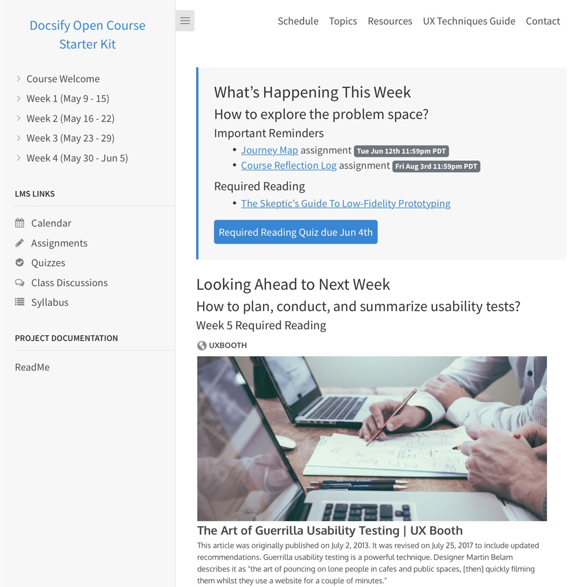

# Docsify Open Course Starter Kit

> This is a starter kit to create an open [Docsify](https://docsify.js.org) course site.

📸 Docsify Open Course Screenshot
---

_Figure 1. Docsify Open Course Starter Kit. Explore a demo at [hibbitts-design.github.io/docsify-open-course-starter-kit/](https://hibbitts-design.github.io/docsify-open-course-starter-kit/)_

🚀 Quick GitHub Pages Install Instructions
---
**Pre-flight Checklist**  

1. GitHub account

**Installation Steps**  

1. Tap **Use this template** on the source repository (upper-right green button)
2. Choose the name for your new repository to contain the copied site files and then tap **Create repository from template**
2. Go to **Settings** of your newly created repository, scroll down to **GitHub Pages** and chose **master branch/docs folder** (see more details in the [Docsify documentation](https://docsify.js.org/#/deploy?id=github-pages))
3. And you're done! (view your new site using the provided URL right below your **GitHub Pages** section - it can take up to 20 minutes for your site to be initially available)

🔗 Change Linked GitHub Repository
---  
1. Edit the file index.html in your repository
2. Find the sample GitHub repository URL https://github.com/hibbitts-design/docsify-open-course-starter-kit and replace it with your own repository URL, for example https://github.com/YourGitHubUsername/Docsify/blob/master/docs/
3. Commit your changes.

💻 Editing your Docsify Site Locally
---  

1. Tap **Clone** on your repository page
2. Choose **Open Desktop** and follow the prompts, installing GitHub Desktop if not already present
3. You will now be able to edit your Docsify site (in the `docs` folder) using the desktop editor of your choice (e.g. atom.io)
4. Use GitHub Desktop to push any changes to your repository. [Learn more about using GitHub Desktop](https://help.github.com/en/desktop/contributing-to-projects/committing-and-reviewing-changes-to-your-project).

You can also clone (i.e download) a copy of your repository to your computer and [run Docsify locally](https://docsify.js.org/#/quickstart) to preview your site. See the below video for details.

Do you use GitLab? You can also use Docsify with [GitLab Pages](https://docsify.now.sh/deploy?id=gitlab-pages)!

🧩 Embedding Docsify Page Content into Other Systems
---  

The optional ‘embedded’ (all lowercase) URL parameter hides a site’s sidebar and optional navbar for seamlessly embedding Docsify page content within another platform such as Canvas LMS, Moodle, Microsoft Teams etc.

To only display Docsify page content, add the following to a Docsify page URL:

`?embedded=true`

For example, https://hibbitts-design.github.io/docsify-open-course-starter-kit/#/ would display a standard Docsify page while https://hibbitts-design.github.io/docsify-open-course-starter-kit/#/?embedded=true would only display page content (i.e. no sidebar or optional navbar is shown).

To optionally hide the 'Edit this Page on GitHub' link, use the following:

For example, https://hibbitts-design.github.io/docsify-open-course-starter-kit/#/ would display a standard Docsify page while https://hibbitts-design.github.io/docsify-open-course-starter-kit/#/?embedded=true&hidegithublink=true would only display page content (i.e. no sidebar or optional navbar is shown) and also hide the 'Edit this Page on GitHub' link.

📼 Video Walkthrough of Local Docsify Install/Config
---
  
_Video 1. Generating Documentation Sites with GitHub and Docsify - Alysson Alvaran_

📚 Learn More about Docsify
---
[Docsify Documentation](https://docsify.js.org/#/?id=docsifyg)

🙇‍Credits and Special Thanks
---
[Docsify Themeable](https://github.com/jhildenbiddle/docsify-themeable)  
